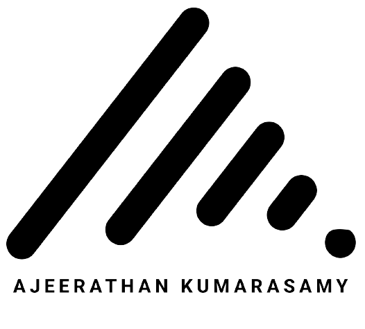

<code><b>I’m Ajee</b>
I’m interested in designing & developing cool things,currently seeking new opportunities to apply my skills in design and development. Please don't hesitate to<a href="mailto:info@aone.no"> EmailMe</a>.</code>

# ConnectMe

 #### <a href="https://www.linkedin.com/">  LinkedIn</a>  connect me on linkedin.

#### <a href="https://www.instagram.com/pro7thphotography/">  Photography</a></a>. Here I showcase my photography portfolio. It's a hobby of mine and sometimes I get paid for it.
  
#### <a href="https://ajee2.netlify.app/">  Acadamic Works</a>. On this website, I have showcased all the portfolios I have built during my studies.
  
#### <a href="https://www.aone.no/">  Paid Works</a>  On this site, I have showcased all my paid works based in Norway.

# Tools & Tech

 &nbsp;&nbsp;  &nbsp;&nbsp;   &nbsp;&nbsp;  &nbsp;&nbsp;  &nbsp;&nbsp;  &nbsp;&nbsp;   &nbsp;&nbsp; &nbsp;&nbsp;  &nbsp;&nbsp;  &nbsp;&nbsp;   &nbsp;&nbsp;  &nbsp;&nbsp; &nbsp;&nbsp;   &nbsp;&nbsp; &nbsp;&nbsp;   &nbsp;&nbsp;   &nbsp;&nbsp; &nbsp;&nbsp;  &nbsp;&nbsp; &nbsp;&nbsp;  &nbsp;&nbsp;   &nbsp;&nbsp; &nbsp;&nbsp;   &nbsp;&nbsp;

<!---
gitAji/gitAji is a ✨ special ✨ repository because its `README.md` (this file) appears on your GitHub profile.
You can click the Preview link to take a look at your changes.
--->

  

 

 

 

